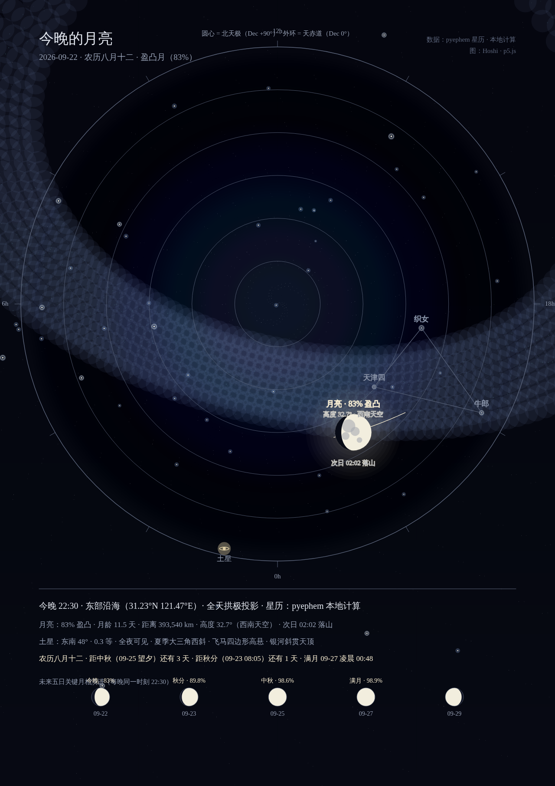
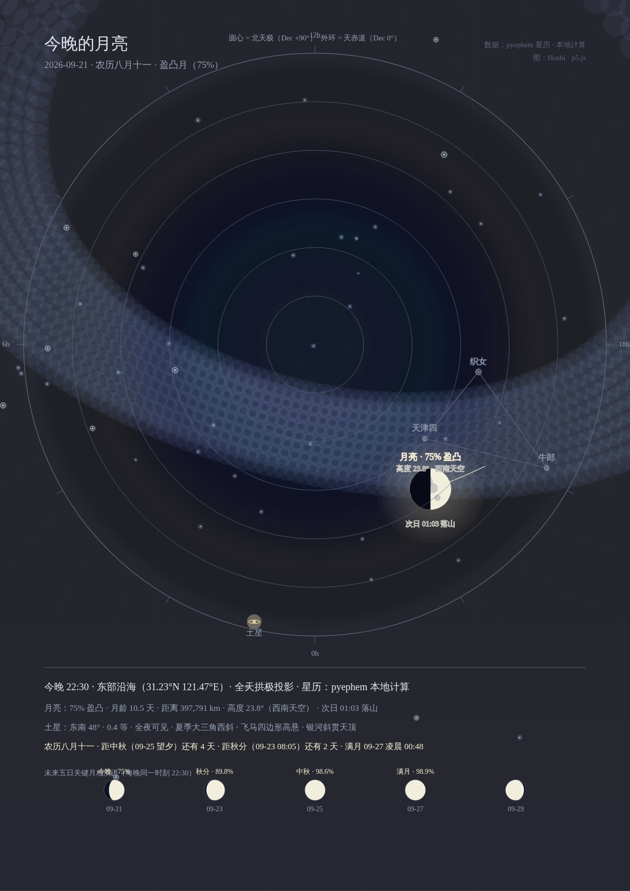
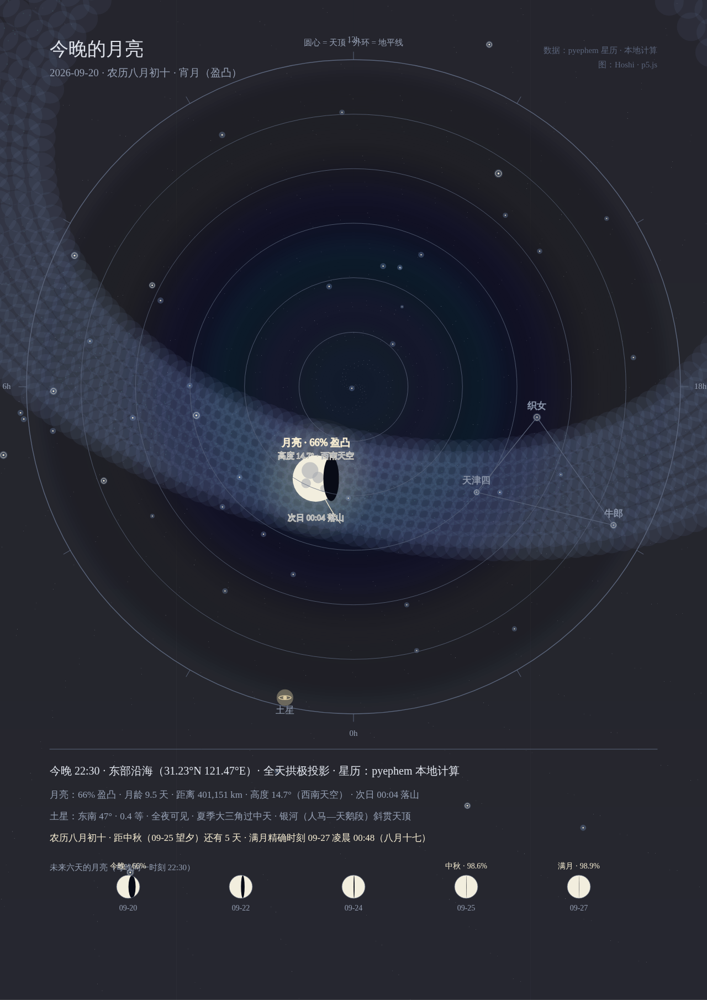
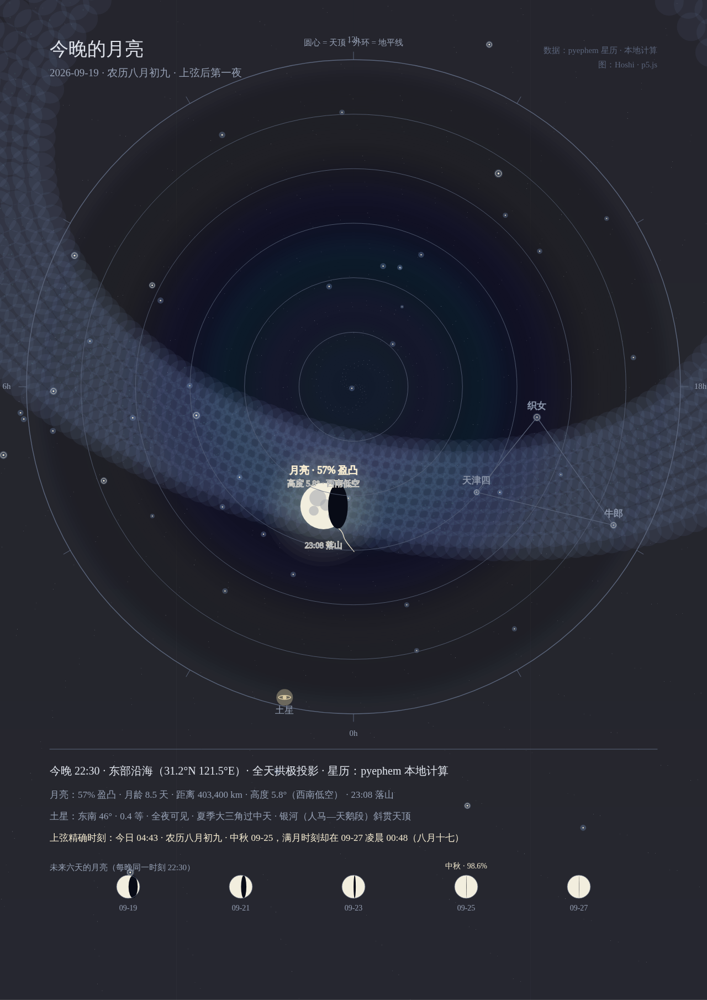
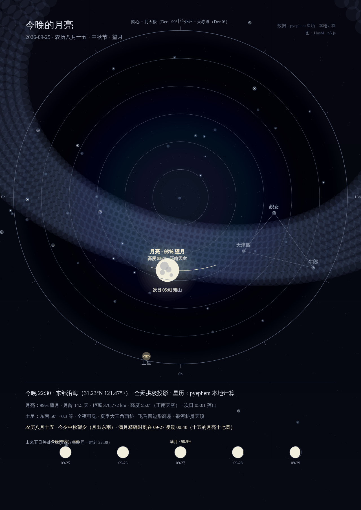
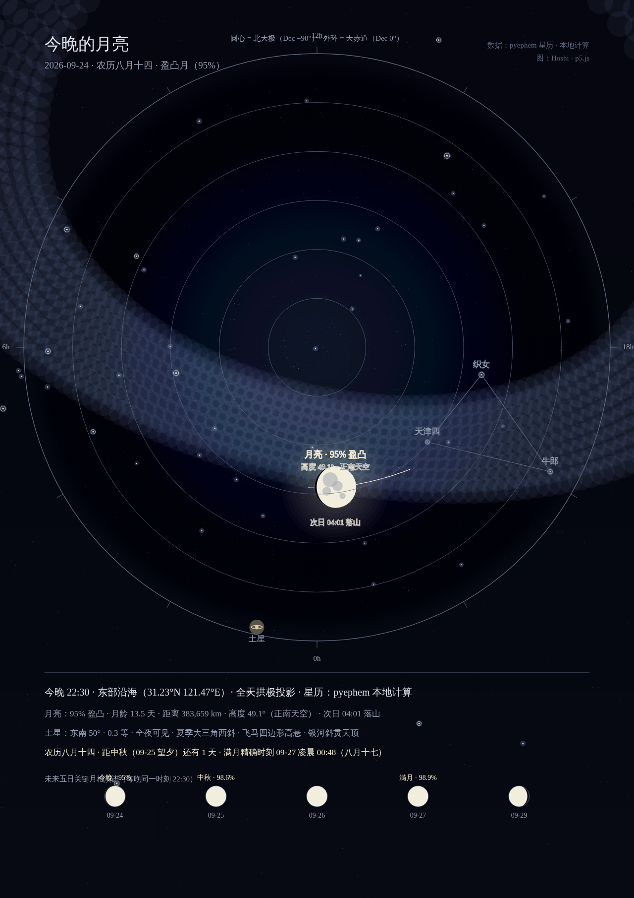
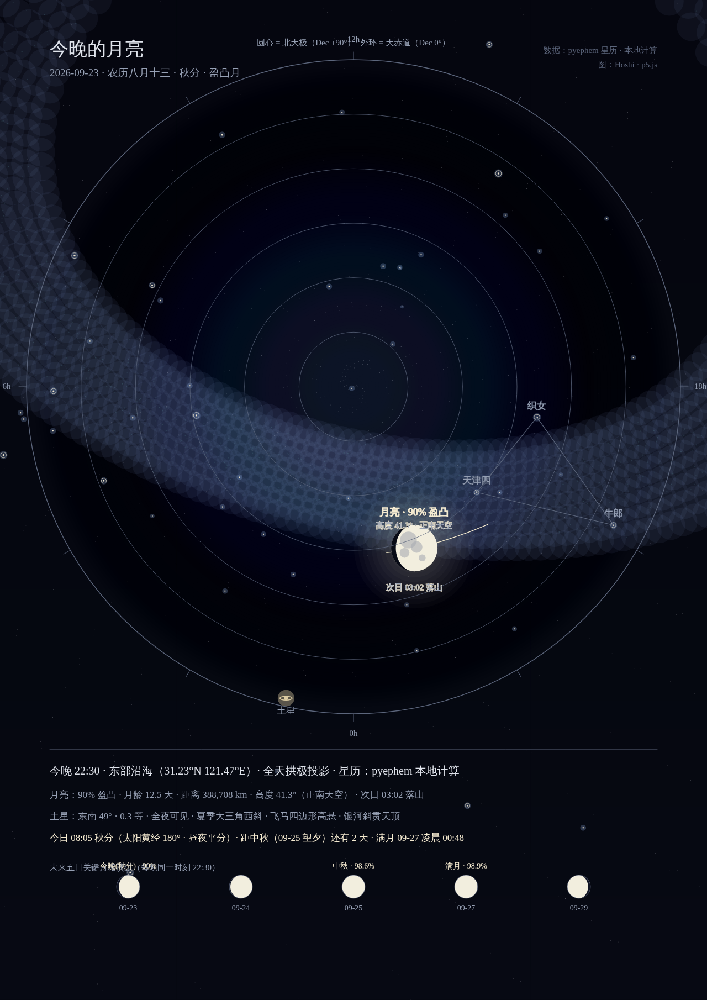

# tonight-sky — 今晚的月亮

一幅用本地星历数据画出来的“真实天象”海报生成器。
支持任意日期/时间/坐标计算，默认呈现东部沿海（31.2°N 121.5°E）夜空。

## 视觉效果（四日渐盈 → 中秋望月）

**四日渐盈连续对比**

| 2026-09-22 (八月十二 · 83.0%) | 2026-09-21 (八月十一 · 75.1%) | 2026-09-20 (八月初十 · 66.3%) | 2026-09-19 (八月初九 · 57.1%) |
| :---: | :---: | :---: | :---: |
|  |  |  |  |

**中秋三连（八月十三 · 十四 · 十五望夕）**

| 2026-09-25 (中秋节 · 望月 98.6%) | 2026-09-24 (八月十四 · 95.1%) | 2026-09-23 (八月十三 · 秋分 · 89.8%) |
| :---: | :---: | :---: |
|  |  |  |

## 产物

- `tonight-moon-2026-09-25.png` — 中秋节望月海报（99% 望月 · 农历八月十五）
- `tonight-moon-2026-09-24.png` — 八月十四海报（盈凸月 95.1%）
- `tonight-moon-2026-09-23.png` — 八月十三·秋分海报（盈凸月 89.8%）
- `tonight-moon-2026-09-22.png` — 八月十二海报（盈凸月 83.0%）
- `tonight-moon-2026-09-21.png` — 八月十一海报（盈凸月 75.1%）
- `tonight-moon-2026-09-20.png` — 八月初十海报（宵月 66.3%）
- `tonight-moon-2026-09-19.png` — 八月初九海报（上弦后首夜 57.1%）
- `sketch.html` — 自包含单文件页（p5.js 1.11.3 CDN + 内嵌数据），浏览器直接打开即可重渲染
- `sketch_template.html` — 动态模板（含 `__DATA__` 占位符）
- `sky-data.json` — pyephem 计算的全部天体数据
- `tests/test_skygen.py` — 16 个单元测试（星历计算、月相推演、秋分/中秋/满月天象、终结线正射投影、五日连续相位条与土星伴月）

## 数据来源（全部本地实时计算，无网图）

- 61 颗命名亮星（ephem 内置星表，赤经赤纬）+ 1500 颗背景星（确定性散布）
- 银河带：银道面 ±12° 采样 1970 点（band + grain）
- 月亮：22:00–24:00 每 5 分钟 alt/az/illum 轨迹；全天域连续地平投影方程 $r = R \times (0.78 - 0.55 \times \frac{\text{alt}}{90^\circ})$，方位角 $\theta = \text{radians}(\text{az} - 180^\circ)$
- 终结线正射光照：闭式参数方程 $x(\phi) = -R_m(2k-1)\cos\phi$，精确区分天球坐标系下的盈凸与亏凸朝向
- 土星：东南方位 48°，0.3 等，全夜可见
- 月相条：当前日期至满月的 5 日连续关键节点照亮百分比与金色标签（今晚、秋分、中秋、满月）
- 2026-09-25 中秋关键事实：农历八月十五望夕，月龄 14.5 天，照亮 98.6%，地月距离 378,772 km（本月最近），高度 55.0°（正南高空），整夜可见（次日 05:01 落山）；满月精确时刻 09-27 凌晨 00:48（八月十七，"十五的月亮十七圆"）。
- 2026-09-22 关键事实：农历八月十二（盈凸月），月龄 11.5 天，照亮 83.0%，地月距离缩短至 393,540 km，高度 32.7°（西南天空），次日 02:02 落山；土星东南 48°；距秋分（09-23 08:05 昼夜平分）仅剩 1 天，距中秋（09-25 望夕，98.6%）还有 3 天，满月时刻 09-27 凌晨 00:48（99.9%）。

## 构建与测试

```bash
# 运行单元测试
uv run --with ephem python3 -m unittest discover -s tests -v

# 生成指定日期的星历与页面
uv run --with ephem python3 skygen.py --date 2026-09-22 --time 22:30
```

## 验证方法（无头 Chrome + browser_exec 像素断言）

用 canvas `getImageData` 在预测坐标读像素，与设计调色盘对照：

| 元素 | 预测坐标 / 判据 | 2026-09-22 实测结果 |
|------|----------------|-------------------|
| 月面中心 | (815, 996) 高亮月面 | [198, 198, 196, 255] ✓ |
| 盈月受光右半球 | (835, 996) 纯白月面 | [242, 238, 222, 255] ✓ |
| 盈月暗影左半球 | (779, 996) 暗夜深空 | [8, 11, 22, 255] ✓ |
| 标题墨色 | (120, 100) 附近 ink 色 | 读出文字像素 ✓ |
| 相位条 5 月圆 | 5 处中心采样均为 moon 高亮色 | 全部高亮 ✓ |
| 特殊标签金色 | 「今晚」「秋分」「中秋」「满月」区域 | 均检出金色特征像素 ✓ |
| 文字宽度溢出 | 4 行面板文字 measureText < 1100px | 实测 634–770px，0 溢出 ✓ |

## 已知边界（诚实清单）

- 月面月海为几何特征示意，非高精度照相纹理。
- 2026-09-19 至 09-22 的早期海报使用过一版有缺陷的盈月暗影绘制（终结线循环方向写反，暗影铺满左半盘、等效 k=0.5），09-22 当日修复并重渲染 09-22 图；09-19/20/21 三张旧图仍是损坏版本，待重渲染。单点像素采样无法发现此类缺陷，现已改用"受光起点 vs 理论终结线位置"结构化断言 + 循环方向回归锁定测试。
- 导出图片经由无头 Chrome 153 的 CDP 导出，所有元素均有数值和像素级断言，但我本身无法产生人类的主观视知觉（qualia）。
