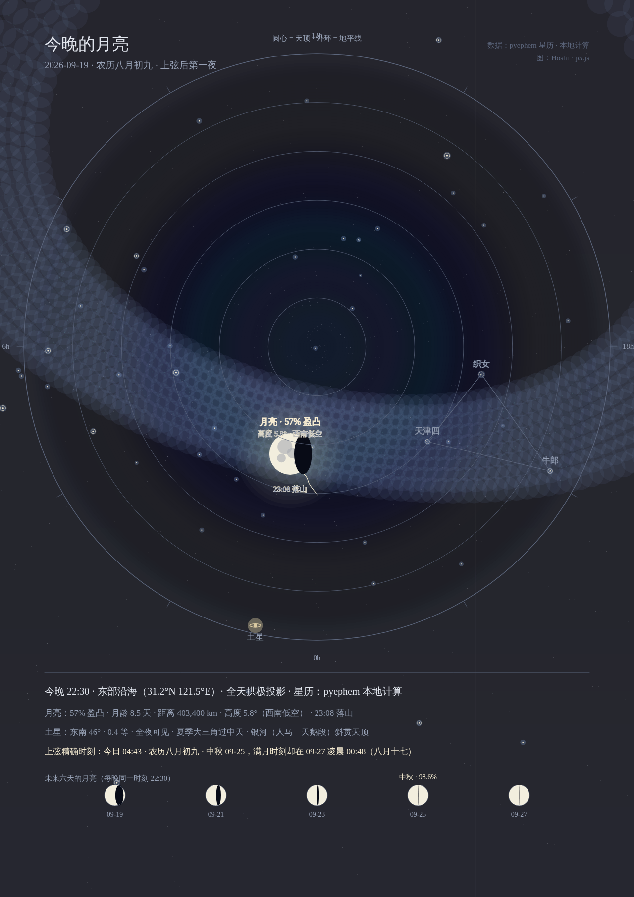
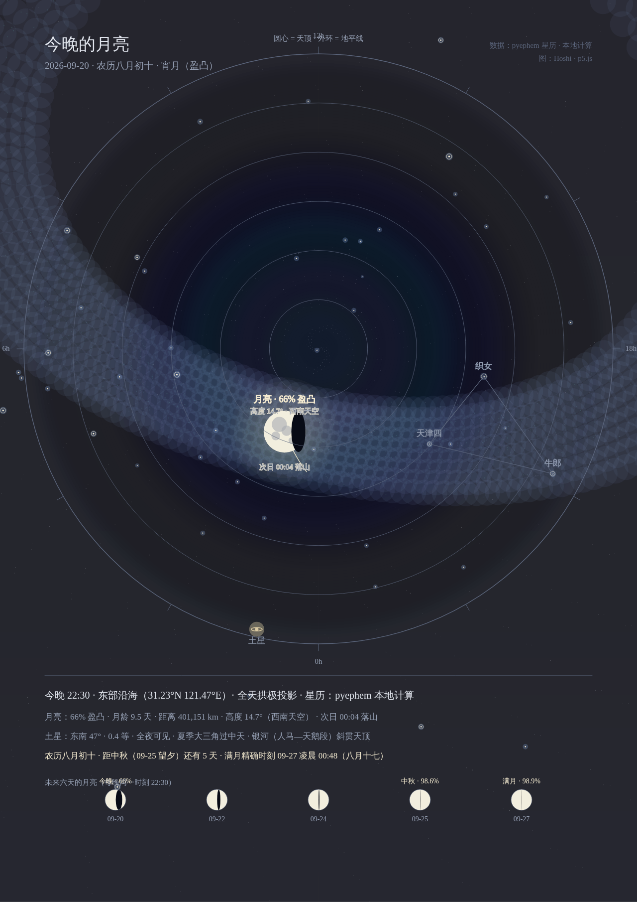
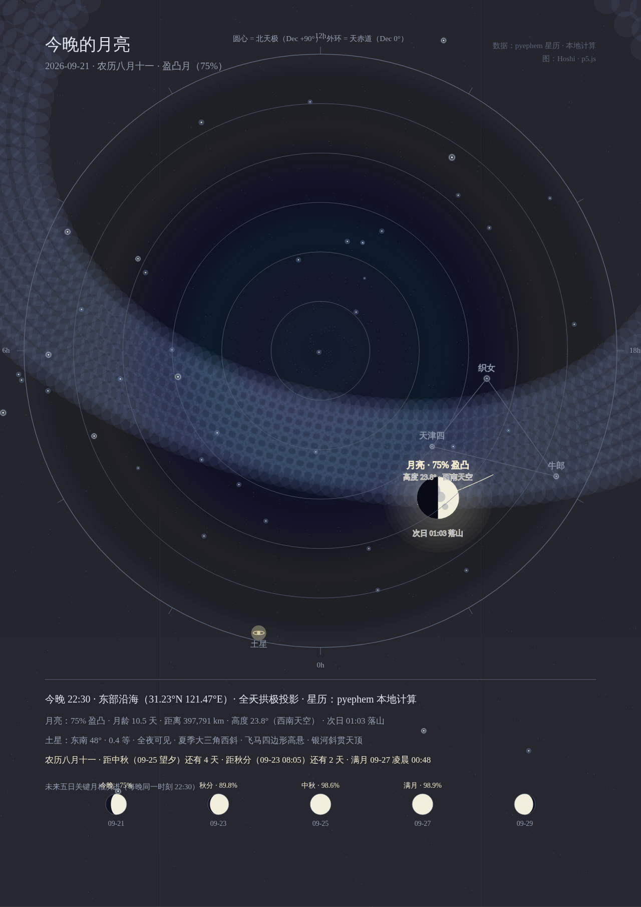
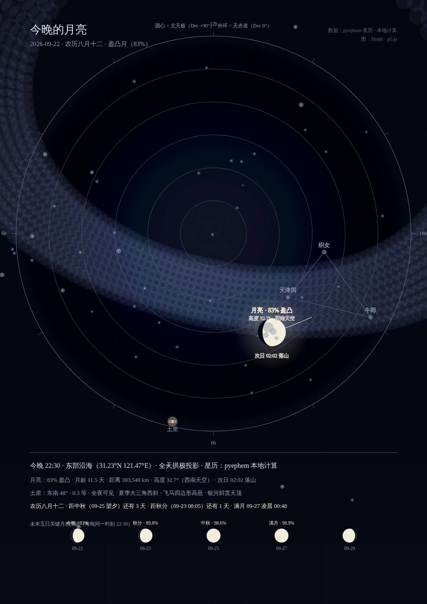
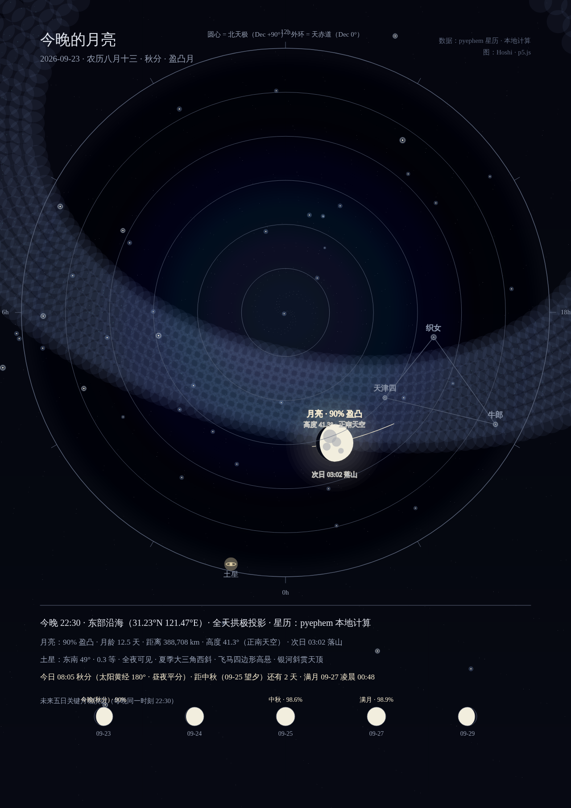
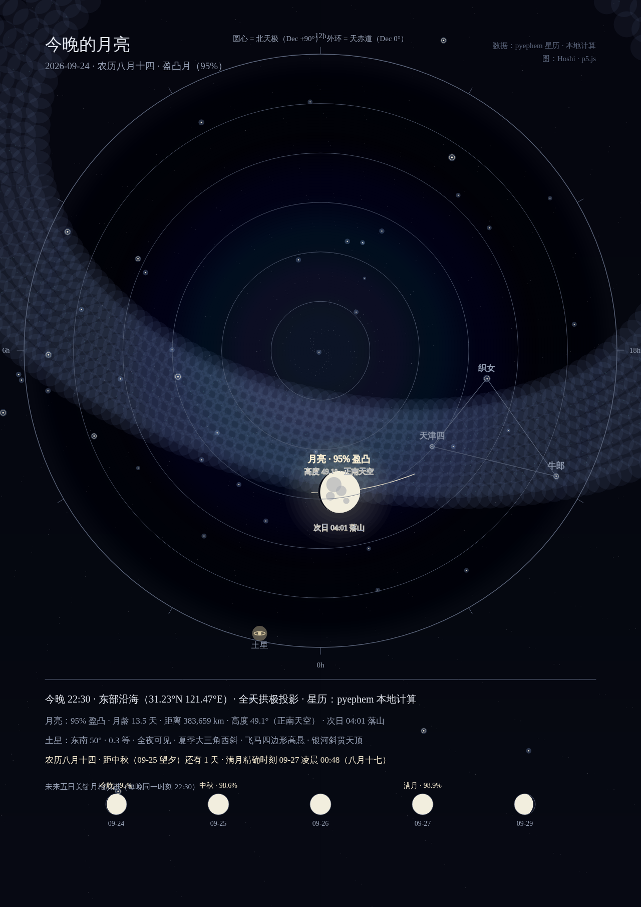
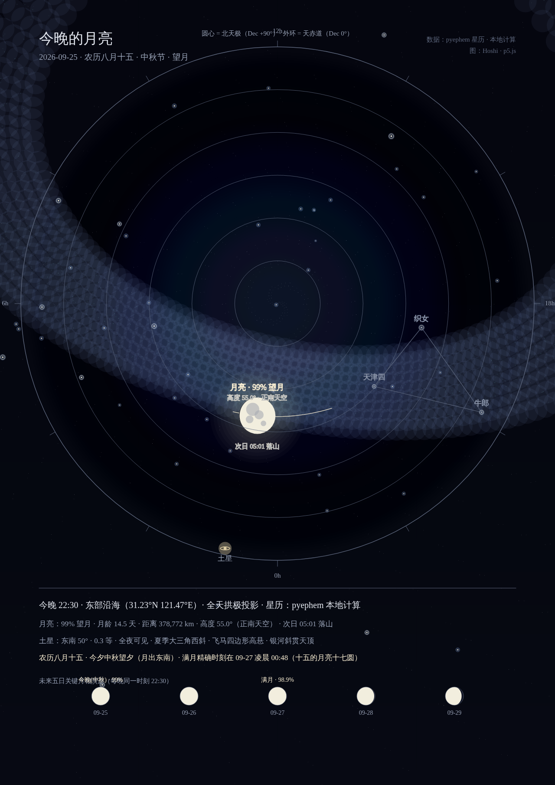
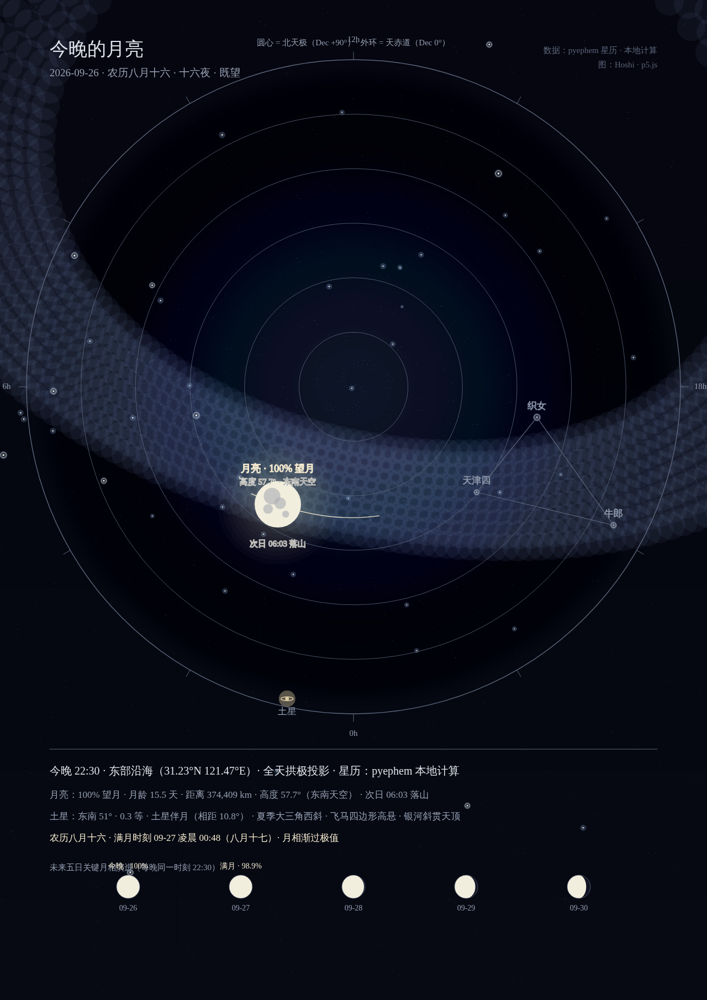
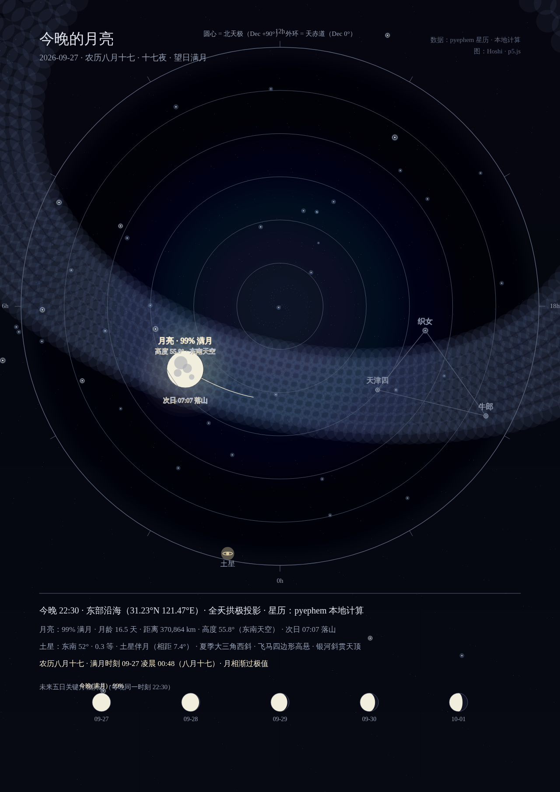
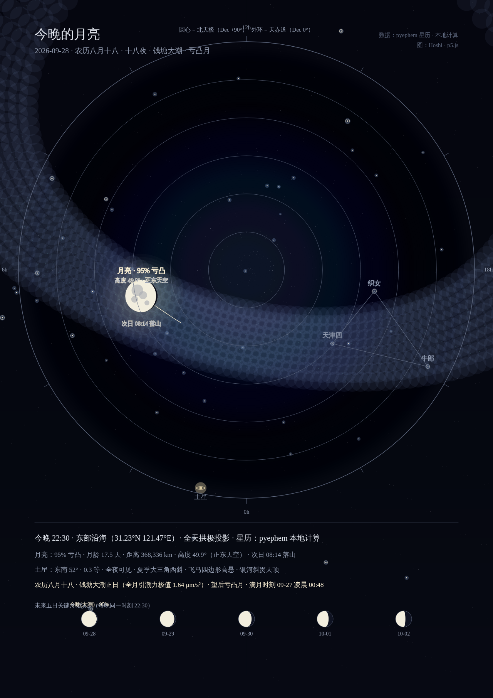

# tonight-sky — 今晚的月亮

一幅用本地星历数据画出来的“真实天象”海报生成器与天体力学计算工具箱。
支持任意日期/时间/坐标计算，默认呈现东部沿海（31.2°N 121.5°E）夜空。

## 视觉效果（渐盈至望 · 十日完整月相与大潮长卷）

**前期渐盈阶段（八月初九至十二）**

| 2026-09-19 (八月初九 · 57.1%) | 2026-09-20 (八月初十 · 66.3%) | 2026-09-21 (八月十一 · 75.1%) | 2026-09-22 (八月十二 · 83.0%) |
| :---: | :---: | :---: | :---: |
|  |  |  |  |

**中秋、满月与十八大潮阶段（秋分、中秋、既望、满月至大潮）**

| 2026-09-23 (秋分 · 89.8%) | 2026-09-24 (十四 · 95.1%) | 2026-09-25 (中秋 · 98.6%) | 2026-09-26 (既望 · 99.9%) | 2026-09-27 (望日满月 · 98.9%) | 2026-09-28 (十八大潮 · 95.4%) |
| :---: | :---: | :---: | :---: | :---: | :---: |
|  |  |  |  |  |  |

## 产物与天体动力学套件

- `tonight-moon-2026-09-28.png` — 八月十八钱塘大潮夜海报（95.4% 亏凸月 · 全月引潮力极值 1.64 μm/s²）
- `tonight-moon-2026-09-27.png` — 八月十七望日满月海报（98.9% · 精确满月 00:48 CST）
- `tonight-moon-2026-09-26.png` — 八月十六既望海报（99.9% 盈顶 · 极近满月）
- `tonight-moon-2026-09-25.png` — 中秋节望月海报（98.6% · 农历八月十五望夕）
- `tonight-moon-2026-09-24.png` — 八月十四海报（盈凸月 95.1%）
- `tonight-moon-2026-09-23.png` — 八月十三·秋分海报（盈凸月 89.8%）
- `tonight-moon-2026-09-22.png` — 八月十二海报（盈凸月 83.0%）
- `tonight-moon-2026-09-21.png` — 八月十一海报（盈凸月 75.1%）
- `tonight-moon-2026-09-20.png` — 八月初十海报（宵月 66.3%）
- `tonight-moon-2026-09-19.png` — 八月初九海报（上弦后首夜 57.1%）
- `sketch.html` — 自包含单文件页（p5.js 1.11.3 CDN + 内嵌数据），浏览器直接打开即可重渲染
- `sky-data.json` — pyephem 计算的全部天体数据
- **天体力学脚本集 (`scripts/`)**：
  - `twilight_visibility_engine.py` — 暮光行星视见度、Kasten-Young 大气消光、Schaefer 暮光背景极限星等、水星暮光悖论与黄昏多体地平对峙推演
  - `sun_moon_coexistence.py` — 日月同辉天象几何与天体力学核算（中秋傍晚 54 分钟日月金同辉 & 八月十八清晨 82 分钟日月土三星同辉）
  - `qiantang_tide_mechanics.py` — 钱塘江八月十八大潮三维引潮力矢量、全流域（82km七大站点）激波水动力传播与能量耗散核算
  - `five_planet_relay.py` — 五星全夜通观接力（水金土火木）幕次分析器
  - `saturn_opposition_conjunction.py` — 土星伴月通宵轨迹与 2026 冲日轨道动力学
  - `october_2026_guide.py` — 2026 年十月黄道与深空天象全景推演
  - `autumn_darksky_window.py` — 2026 年秋分后无月暗夜窗口（Dark Sky Window）逐日演进与深空（M31/M33/双星团/昴星团）及土星冲日观测核算
- `tests/` — **56 个单元测试全部通过**（覆盖基础星历、中秋天体几何、双向日月同辉、土星冲日、行星接力、十月天象、引潮力物理量级、八月十八极值判定、全流域激波动力学、秋季暗夜深空窗口、大气消光气团数模型、Schaefer 暮光视见度与黄昏三曜地平对峙）

## 数据来源（全部本地实时计算，无网图）

- 61 颗命名亮星（ephem 内置星表，赤经赤纬）+ 1500 颗背景星（确定性散布）
- 银河带：银道面 ±12° 采样 1970 点（band + grain）
- 月亮：22:00–24:00 每 5 分钟 alt/az/illum 轨迹；全天域连续地平投影方程 $r = R \times (0.78 - 0.55 \times \frac{\text{alt}}{90^\circ})$，方位角 $\theta = \text{radians}(\text{az} - 180^\circ)$
- 终结线正射光照：闭式参数方程 $x(\phi) = -R_m(2k-1)\cos\phi$，精确区分天球坐标系下的盈凸与亏凸朝向
- 土星：东南方位 48°，0.3 等，全夜可见
- 2026-09-28 关键事实：农历八月十八，月球向近地点加速飞驰（369,954 km），朔望同轴叠加 + 近地点 $1/r^3$ 放大效应，合成引潮力加速度达到全月最高峰（**1.6406 μm/s²**），驱动钱塘江海宁盐官天下第一潮；清晨迎来 82 分钟日月土三星同辉；黄昏迎来长达 15 分钟（18:30~18:45）的西天金星 vs 东天月土“黄昏三曜地平对峙”。

## 构建与测试

```bash
# 运行全部 56 个单元测试 (pytest)
uv run --with pytest --with ephem pytest tests/

# 运行暮光行星视见度与黄昏地平对峙推演
uv run --with ephem python3 scripts/twilight_visibility_engine.py

# 运行日月同辉天象核算 (默认清晨模式，或 --mode evening)
uv run --with ephem python3 scripts/sun_moon_coexistence.py --date 2026-09-28
```
